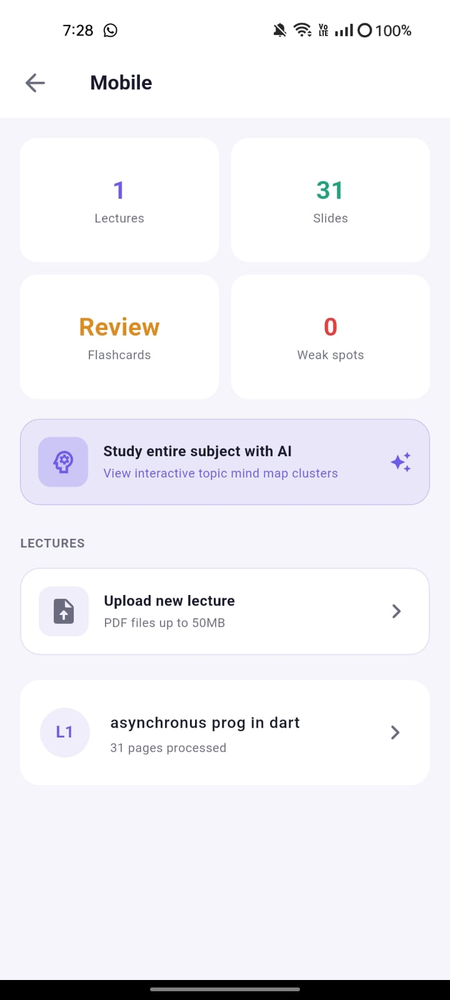
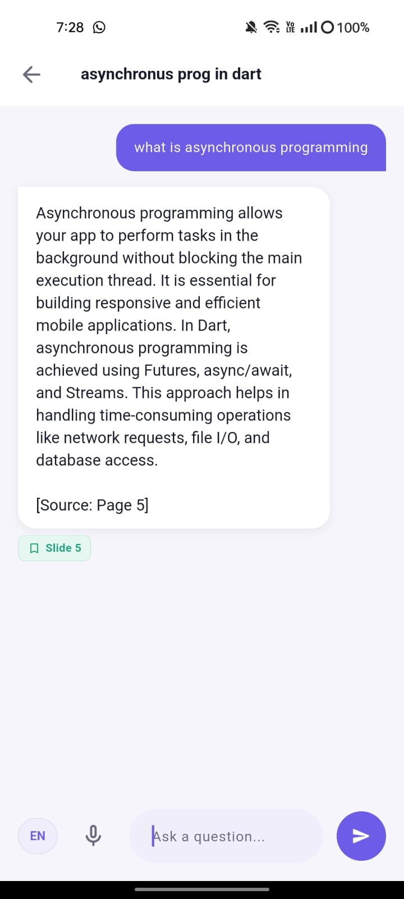
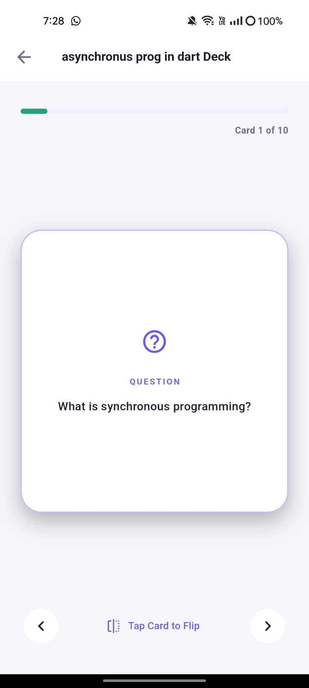
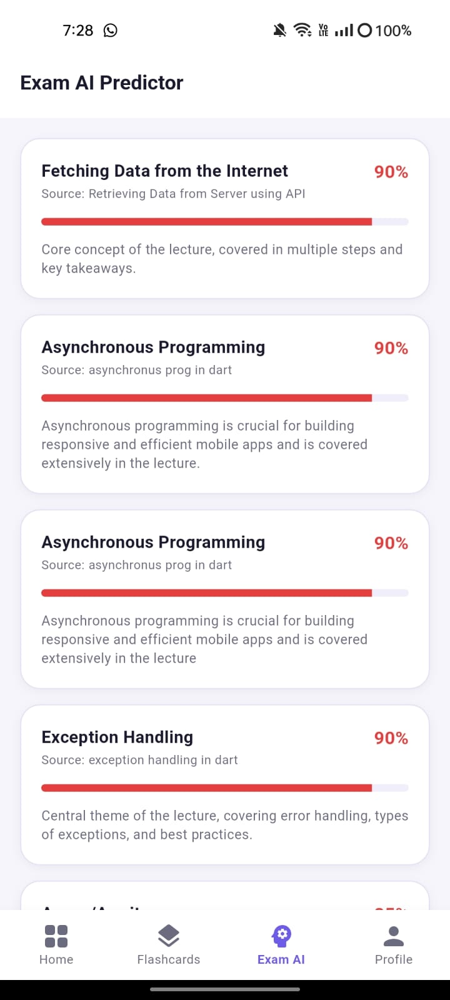
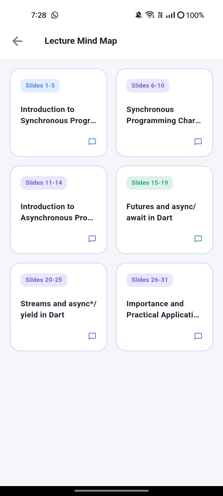

# Lumio — AI-Powered Lecture Study App

> **Light up your lectures** — Turn any PDF into an interactive AI tutor in seconds.

---

## What is Lumio?

Lumio is a Flutter mobile application that helps university students study smarter. Upload any lecture PDF and Lumio instantly transforms it into a complete study session — ask questions in Urdu or English, get AI-generated flashcards, see which topics will likely appear in your exam, and visualize your entire lecture as an interactive mind map.

---

## Problem it Solves

Students waste hours scrolling through 80-slide PDFs trying to find one concept before exams. Lumio solves this by making every lecture PDF conversational — you simply ask what you want to know and get the answer instantly from your own slides.

---

## Features

| Feature | Description |
|---|---|
| AI Chat | Ask anything about your lecture in Urdu or English — AI answers from your exact slides with slide number reference |
| Voice Input | Speak your question — supports Urdu and English speech-to-text |
| Auto Flashcards | 10 Q&A flashcards generated automatically when you upload a PDF |
| Exam Predictor | AI ranks lecture topics by how likely they are to appear in your exam |
| Mind Map | Visual overview of all lecture topics — tap any node to chat about it |
| Weak Spot Tracker | Tracks which topics you get wrong in flashcards and shows a personalised focus list |
| Progress Tracking | Home screen shows study progress per subject based on lectures opened |
| Multi-subject | Organise lectures by subject — OS, Database, OOP — each with its own hub |
| Offline Flashcards | Flashcards saved locally with Hive — work without internet |
| Auth System | Email/password signup and login — each student sees only their own data |

---

## Screenshots

<div align="center">

  

  

 

</div>

---

## Tech Stack

| Layer | Technology |
|---|---|
| Frontend | Flutter 3.x (Dart) |
| Backend / Database | Firebase Firestore |
| Authentication | Firebase Auth |
| File Storage | Firebase Storage |
| AI Engine | Groq API (llama-3.3-70b-versatile) |
| PDF Text Extraction | Syncfusion Flutter PDF |
| Voice Input | speech_to_text |
| Local Storage | Hive Flutter |
| Environment Variables | flutter_dotenv |

---

## Architecture

```
User uploads PDF
      ↓
Flutter extracts text (Syncfusion)
      ↓
Groq AI generates:
  → 10 Flashcards
  → Exam topic predictions
  → Mind map topic clusters
      ↓
All saved to Firestore + Hive
      ↓
User studies via Chat / Flashcards / Exam AI / Mind Map
```

---

## Project Structure

```
lib/
├── main.dart
├── firebase_options.dart
├── screens/
│   ├── auth/
│   │   ├── login_screen.dart
│   │   └── signup_screen.dart
│   ├── home_screen.dart
│   ├── subject_screen.dart
│   ├── lecture_detail_screen.dart
│   ├── chat_screen.dart
│   ├── flashcard_screen.dart
│   ├── exam_predictor_screen.dart
│   ├── mindmap_screen.dart
│   ├── weak_spots_screen.dart
│   ├── profile_screen.dart
│   └── splash_screen.dart
├── services/
│   └── gemini_service.dart
└── widgets/
    └── app_widgets.dart
```

---

## Getting Started

### Prerequisites
- Flutter SDK 3.x
- Dart SDK
- Android Studio or VS Code
- Firebase account
- Groq API key (free at console.groq.com)

### Installation

**1. Clone the repository**
```bash
git clone https://github.com/yourusername/lumio.git
cd lumio
```

**2. Install dependencies**
```bash
flutter pub get
```

**3. Set up Firebase**
```bash
dart pub global activate flutterfire_cli
flutterfire configure
```

**4. Create `.env` file in root directory**
```
GEMINI_API_KEY=your_groq_api_key_here
```

**5. Add `.env` to `pubspec.yaml` assets**
```yaml
flutter:
  assets:
    - .env
```

**6. Run the app**
```bash
flutter run
```

---

## Firebase Collections

| Collection | Fields |
|---|---|
| users | name, email, university, createdAt |
| subjects | userId, name, icon, color, progress |
| lectures | subjectId, title, slideText, summary, pdfUrl, opened |
| flashcards | lectureId, question, answer |
| weakspots | userId, lectureId, topic, wrongCount |

---

## Key Dependencies

```yaml
dependencies:
  firebase_core: ^3.x
  firebase_auth: ^5.x
  cloud_firestore: ^5.x
  firebase_storage: ^12.x
  google_generative_ai: ^0.4.x
  hive_flutter: ^1.x
  syncfusion_flutter_pdf: ^26.x
  speech_to_text: ^7.x
  file_picker: ^8.x
  flutter_dotenv: ^5.x
  shared_preferences: ^2.x
  http: ^1.x
```

---


## License

This project is built for educational purposes

---

*Built with Flutter · Powered by Groq AI · Backed by Firebase*